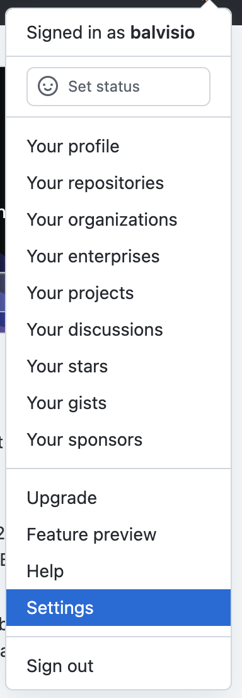

# OCT Segmenter

The `oct-segmenter` is a command line interface (CLI) tool that allows
researchers to automatically segment OCT images. The `oct-segmenter` also
provides the following abilities: 

- Creating training and test datasets
- Training machine learning models

The `oct-segmenter` was developed with a focus on the needs of researchers
working in the ophthalmology field. However, this tool is flexible enough that
it can also accommodate other use cases as well.

## Prerequsites

If this is your first time checking out this repository, you'll want to
checkout the submodules:

```
git submodule update --init --recursive
```

You may also find it easier to install the oct-segmenter if you use Anaconda
instead of a Python virtual environment.

- Install [Anaconda](https://www.anaconda.com/download).

- Create a new Conda environment:

`conda create --name oct-segmenter-env python=3.10`

- Activate the environment:

`conda activate oct-segmenter-env`

## Installation

### Creating Python Wheels

From the root of the project directory, run the following commands to create
the Python wheels:

```
pip install wheel
./build.sh 
cd oct-image-segmentation-models-mod
./build.sh
```

This will create two wheel files:

- `oct-segmenter/dist/oct_segmenter-0.8.0-py2.py3-none-any.whl`
- `oct-image-segmentation-models-mod/dist/oct_image_segmentation_models-0.8.0-py2.py3-none-any.whl`

### Installing The Oct-Segmenter

From the root of the project directory, install the
[Surface-Distance-Based-Measures](https://github.com/deepmind/surface-distance)
package. The `oct-segmenter` uses a library which at the time of this writing
is not published as Python package. To install it:

```
git clone https://github.com/deepmind/surface-distance.git
pip install surface-distance/
```

From the root of the project directory, run the following commands to install
the wheels:

```
pip install \
    --trusted-host pypi.org \
    --trusted-host files.pythonhosted.org \
    ./oct-image-segmentation-models-mod/dist/oct_image_segmentation_models-0.8.0-py2.py3-none-any.whl

pip install \
    --trusted-host pypi.org \
    --trusted-host files.pythonhosted.org \
    ./dist/oct_segmenter-0.8.0-py2.py3-none-any.whl
```

## Usage

### Partitioning Input Images into Datasets

`oct-segmenter partition` can be used to partition a directory containing the
images and CSVs into the training, validation and test datasets. It creates a
random permutation and partitions the images according to the fractions passed
in the `--training`, `--validation` and `--test` flags.

Defaults are: training: `0.56`, validation: `0.14`, test: `0.3`.

The `oct-segmenter` requires that the names of image files and their
corresponding CSVs to be identical.

#### Example

`oct-segmenter partition -i <path/to/input/images> -o
<path/to/output/partition> --training 0.3 --validation 0.5 --test 0.2`


### Generating Training Dataset HDF5 File

Given one directory containing images to be used for training and a second one
with images containing images used for validation, `oct-segmenter generate
training` creates a HDF5 file named `training_dataset.hdf5` that contains the
images used for training and validation in a format that can be directly be
used to train an `oct-unet` model.

The `oct-segmenter` requires that the names of image files and their
corresponding CSVs to be identical.

#### Example

`oct-segmenter generate training --training-input-dir <path/to/training/dir> --validation-input-dir
<path/to/validation/dir> -o <directory/to/place/the/training_hdf5_file>`


### Generating Test Dataset HDF5 File

Given one directory containing images to be used for testing `oct-segmenter
generate test` creates a HDF5 file named `test_dataset.hdf5` that contains the
images used for testing in a format that can be directly be used for evaluation
using an already trained `oct-unet` model.

The `oct-segmenter` requires that the names of image files and their
corresponding CSVs to be identical.

#### Example

`oct-segmenter generate test -i <path/to/test/dir> -o <directory/to/place/the/test_hdf5_file>`

### Listing and selecting available models

`oct-segmenter` is packaged with trained models. Currently the included models are:
- `visual-function-core`: Model trained with images provided by the NIH-NEI
  Visual Function Core group.
- `wayne-state-university`: Model trained with images provided by Wayne State
  University.

To list the available models:

```
oct-segmenter list
```

The command will display the list of available models and the default model to
use in the `predict` and `evaluate` subcommands.

The command will prompt the user to type a number to select a new default
model. If no change is desired, press `Enter`.

### Prediction

To generate labels for new images there are two options available:

- `-i`: Give path to the TIFF file to be labeled.
- `-d`: Give path to a directory. The `oct-segmenter` tool will look for all
  `.tiff` files and generate labels for each of them.

#### Examples

```
oct-segmenter predict -i myimage.tiff -o myoutput
oct-segmenter predict -d testing_images
```

### Evaluation

To evaluate the model with a test dataset use the `oct-segmenter evaluate`
subcommand. It requires a test dataset (HDF5 file) as an input which can be
generated using the `generate test` subcommand. [See
above](#generating-test-dataset-hdf5-file) for more details.

The user must configure the evaluation parameters by providing a JSON formatted
configuration file like the following:

```
{
  "graph_search": true,
  "metrics": ["dice", "average_surface_distance", "hausdorff_distance"]
}
```

In addition to generating plots with labels, `evaluate` will create a
`results.csv` and `results.hdf5` that contain the following model's performance
statistics:

- `Mean absolute errors`
- `Mean errors`
- `Median absolute errors`
- `SD abs errors`
- `SD errors`
- `Mean dices`
- `SD dices`


#### Example

```
oct-segmenter evaluate \
    -i test_dataset.hdf5 \
    -c config.json \
    -o evaluation-results/
```

### Evaluation Configurable Parameters

The following is a list of the parameters that can be configured for
evaluation:

- `graph_search`: bool: Perform a graph search based on the model predictions
  to generate the delineations of the layers.
- `metrics`: Metrics to compute as part of the evaluation. Currently supported
  metrics are: `dice_coef_classes`, `dice_coef_macro`, `dice_coef_micro`,
  `average_surface_distance` and `hausdorff_distance`.

## Advanced Usage

### Training

The `oct-segmenter` provides the functionality to train a model from
scratch. The user must input a training dataset generated by the
`oct-segmenter generate train` command
([see above](#generating-training-dataset-hdf5-file)).
The user must configure the training parameters by providing a JSON formatted
configuration file like the following:

```
{
  "model_architecture": "unet",
  "model_hyperparameters": {
    "conv_layers": 3
  },
  "epochs": 1000,
  "batch_size": 3,
  "augment": true,
  "augmentations": [
    {
      "name": "no_augmentation"
    },
    {
      "name": "flip",
      "arguments": {
        "flip_type": "up-down"
      }
    },
    {
      "name": "flip",
      "arguments": {
        "flip_type": "left-right"
      }
    },
    {
      "name": "add_noise",
      "arguments": {
        "mode": "gaussian",
        "mean": 0,
        "variance": 0.01
      }
    }
  ]
  "experiment": "my-experiment",
  "tracking_uri": "mlruns",
  "username": "balvisio",
  "password": "changeme" # Not recommended in JSON
}
```

#### Example

The following command shows how to start a training run:
```
oct-segmenter train -i <path/to/training/dataset/hdf5/file> \
  -o <path/to/output> -c <path/to/config/json>
```

### MLflow Support

The `oct-segmenter` supports logging runs using the MLflow library. Runs can be
saved locally by default and can also be saved to a remote tracking server by
setting the `tracking_uri` in the config file
([See Training Configurable Parameters](#training-configurable-parameters)).


For instructions on how to setup a remote MLflow tracking server visit the
following
[GitHub gist](https://gist.github.com/balvisio/2cd02a4f403872893d0f3fd8de1f6fba)

To run the MLflow server locally run: `mlflow ui`.

*MacOS Note*: By default, MLflow runs in port 5000. However, in MacOS Monterey
the `ControlCenter` process, which is a native macOS application, uses port
5000. Thus, you can make the MLflow server listen in another port by
running: `mlflow ui --port <port>`.

### Training Configurable Parameters
The following is a list of the parameters that can be configured for training:
- `model_architecture`: string: The model architecture to use for training.
  Current supported values are: `"unet"` and `"deeplabv3plus"`.
- `model_hyperparameters`: dict: A dictionary to specify different parameters
  of the model architecture. The key/value pairs will be dependent on the
  chosen `model_architecture` parameter. The allowed values for:
    - `unet`:
        - `start_neurons`: int (default = `8`)
        - `pool_layers`: int (default = `4`)
        - `conv_layers`: int (default = `2`)
        - `enc_kernel`: list (default = `[3, 3]`)
        - `dec_kernel`: list (default = `[2, 2]`)
- `augment`: bool (default = `False`): If `True`, images are augmented
  according to the list specified in the `augmentations` field.
- `augment_validation`: bool (default = `False`): If `True` images in the
  validation set are also augmented according to the list specified in the
  `augmentations` field.
- `augmentations`: list (default = `[]`): A list of dictionaries containing
  information about the augmentation functions to apply and its parameters.
  Each dictionary must contain the following keys:
    - `name`: str: Augmentation function name.
    - `arguments`: dict: (Optional) A dictionary of key/value arguments.
  See [Supported Augmentation Functions](#supported-augmentation-functions)
  section for more information on supported augmentation and examples.
- `batch_size`: int (default = `2`)
- `class_weight`: "balanced" | list | `null` (default = `null`):
    - "balanced": Calculates classes' weights from the class distribution in
      the training and validation datasets. It will use the
      `compute_class_weight` method from the `scikit-learn` library. ([See
      here](https://scikit-learn.org/stable/modules/generated/sklearn.utils.class_weight.compute_class_weight.html))
    - list: List of length equal to the number of classes. Each element is a
      weighting factor for each of the classes.
- `early_stopping`: bool (default = `True`): Stop training when a monitored
   metric has stopped improving.
   ([See EarlyStopping](https://keras.io/api/callbacks/early_stopping/))
- `epochs`: int (default = `1000`)
- `early_stopping`: bool (default = `True`): If `True` training will stop when
  the validation metric stops improving after `<patience>` epochs.
- `experiment`: string: Name of the experiment under which the run will be
  logged in MLflow.
- `loss`: string (default = `dice_loss_macro`): Loss function to use during
  training. Currently supported functions are: `dice_loss_macro`,
  `dice_loss_micro`, `focal_loss`.
- `metric`: string (default = `dice_coef_macro`): Metric to monitor during
  training. Currently supported metrics are: `dice_coef_macro`,
  `dice_coef_micro`.
- `tracking_uri`: string: Tracking URI for logging the run. The URI can either
  be a HTTP/HTTPS URI for a MLflow remote server, a database connection string,
  or a local path to log data to a directory. The URI defaults to `mlruns`.
- `username`: string: MLflow server username.
- `password`: string: MLflow server password.
- `patience`: int (default = `50`) Number of epochs with no improvement after
  which training will be stopped. (Only applicable when
  `early_stopping = True`)

## Supported Augmentation Functions

The augmentation types supported are:

- No augmentation (i.e. use raw image):
  ```
  {
    "name": "no_augmentation",
  }
  ```

- Flip left-right:
  ```
  {
    "name": "flip",
    "arguments": {
      "flip_type": "left-right"
    }
  }
  ```

- Flip up-down:
  ```
  {
    "name": "flip",
    "arguments": {
      "flip_type": "up-down"
    }
  }
  ```

- Add noise:
  ```
  {
    "name": "add_noise",
    "arguments": {
      "mode": "gaussian",
      "mean": 0,
      "variance": 0.01
    }
  }
  ```

## Post-processing (Currently not supported, to be implemented)

The script `/postprocessing/merge_image.py` merges the original image with the
segmentation plots from the model evaluation/prediction. Usage:

```
python merge_image.py \
  <path/to/original/image> \
  <path/to/left/segment/plot> \
  <path/to/right/segment/plot> \
  <path/to/output_file>
```

For example:

```
python merge_image.py \
  ../images/testing/2019.10.23/508_OD_R_1_0_0000097_RegAvg/001.tiff \
  ../../ML-Image-Segmentation/results/2021-09-21_21_26_25_U-net_mice_oct/no\ aug_testing_dataset.hdf5/image_6/seg_plot.png \
  ../../ML-Image-Segmentation/results/2021-09-21_21_26_25_U-net_mice_oct/no\ aug_testing_dataset.hdf5/image_7/seg_plot.png mice4.png
```

# Biowulf

It is possible to easily use the `oct-segmenter` in Biowulf by downloading the
Singularity image published in the GitHub repo. The following instructions show
how to use the `oct-segmenter` in Biowulf. The steps assume some familiarity
with the Linux console.

## Environment Setup

### Setting up Singularity Directories

Singularity uses the directory `$HOME/.singularity/cache` to store downloaded
or generated SIF container images by default. Since this directory might grow
in size and the space in `$HOME` is limited, it is first recommended to change
it to the `/data` partition. The steps are:

1. Run the following command to set the `SINGULARITY_CACHEDIR`:

   ```
   echo "export SINGULARITY_CACHEDIR=/data/$USER/.singularity/cache" >> .bash_profile
   ```

2. For the change to take effect either logout and login again or execute:

   ```
   source .bash_profile
   ```

   Also it is a good idea to create a dedicated directory to store the singularity
   images in the `/data` directory:

   ```
   mkdir /data/$USER/singularity-images
   ```

### Creating a GitHub Personal Access Token (PAT)

A GitHub PAT is required to download the singularity image into Biowulf. The
steps required to create it are:

Go to your GitHub account and click on the your profile icon on top right of
the screen. Once the dropdown menu appears go to "Settings":




### Starting a Interactive Session

Start an interactive session in a compute node in Biowulf. An example command
that requests a node with one NVIDIA K80 GPU:

```
sinteractive --tunnel --gres=gpu:k80:1 --cpus-per-task=8 --mem=32g --time=24:00:00
```

### Load Singularity and Download the Singularity Image

```
module load singularity
singularity registry login --username <github_username> oras://ghcr.io
```

You will be prompted for the GitHub PAT created in the previous section.

Then the oct-segmenter singularity image can be downloaded as:

```
singularity pull --dir /data/$USER/singularity-images oras://ghcr.io/nih-nei/oct-segmenter-singularity:master
```

Detailed information on interactive jobs can be in the [Biowulf User Guide](https://hpc.nih.gov/docs/userguide.html).


# Other Information

## Using the OCT-Segmenter Without Installing Wheels

1. Create a conda or virtual environment and activate it:
```
conda create -n oct-env python=3.10
conda activate oct-env
```

2. Install packages using `pip`:

```
pip install -r requirements.txt
```

3. To run `oct-segmenter` from repo without installing packages:

```
python3 run.py <subcommand> [options]
```

#### Example

```
python3 run.py predict -d images/
```

## Preprocessing

The script `preprocess.py` labels and creates segmentation maps from a given
image. It outputs 4 files:

- <image_name>_{left,right}.json: Two sections of the original image are
  cropped and labeled. These files are `labelme` compatible JSON files.
- <image_name>_{left,right}_label.png: These files are the segmentation maps
  corresponding to the images above.

Usage:

`python preprocess.py </path/to/image> </path/to/output/dir>`

Note: The script assumes that given the path to an input image, a corresponding CSV files with the labels for each layer will
be present in the ◊same directory.


## Building Python Wheel Package

To build the `oct-segmenter` wheel package, from the root directory do

```
./build.sh
```

## Additional Scripts

The repository contains a collection of scripts that were created for a
variety of reasons. The following is a list of them:

- `preprocessing-scripts/custom/trim_upper_and_lower_layers.py`: This script
  takes as input a directory containing TIFF files and their corresponding
  CSVs. It trims the upper and lower layers of the images so that the model can
  focus on all layers. It looks at the whole dataset first to find the image
  with the shortest top layer and uses that as the constraint to trim all the
  dataset. The same procedure is used for the bottom layer.
- `preprocessing-scripts/custom/check_retina_layers_order.py`: This script
  takes as input a directory containing the mask files (in CSV format) and
  checks that the all the expected retina layers are present and in order.
- `preprocessing-scripts/custom/map_image_name_to_subject.py`: This script
  creates a text file that maps an image name provided by VFC or WSU to a
  subject. The generated map has the format: `<image_name> <subject>`.
- `preprocessing-scripts/custom/split_images_into_train_val_test.py`: This
  script takes as input a directory containing TIFF files and their
  corresponding CSVs and a TSV file that maps image name to subject (see
  `preprocessing-scripts/custom/map_image_name_to_subject.py`). It splits the
  images into the training, test and validation datasets making sure that no
  subject appears in more than one partition.
- `preprocessing-scripts/custom/calculate_class_imbalance.py`: This script
  takes as input a directory containing the mask files (in CSV format) and
  calculates the class fractions of each image. It then prints the average
  class fractions across all the images.

# OCT Image Quality Improvement

As part of the development of the `oct-segmenter` and the analysis of OCT
images, the algorithms proposed in the paper "Girard MJ, Strouthidis NG,
Ethier CR, Mari JM. Shadow removal and contrast enhancement in optical
coherence tomography images of the human optic nerve head. Invest Ophthalmol
Vis Sci. 2011;52(10):7738-7748. Published 2011 Sep 29.
doi:10.1167/iovs.10-6925" were implemented in MATLAB. These are the discrete
forms of the algorithm described in the appendix of the paper:

- `preprocessing-scripts/oct-image-contrast-enhancement/comp_exp.m`: Applies
  compensation and then exponentation.
- `preprocessing-scripts/oct-image-contrast-enhancementexp_comp.m`: Applies
  exponentiation and then compensation.
- `preprocessing-scripts/oct-image-contrast-enhancement/comp_only.m`: Applies
  compensation only.

These scripts take a path to a TIFF file as input and save the converted
TIFF to an output file name. To convert all the 'tiff' images in a directory
see the script
`preprocessing-scripts/oct-image-contrast-enhancement/enhance_images_contrast.m`
